## spconv

md 格式：https://www.cnblogs.com/cc-freiheit/p/10511107.html  
https://blog.csdn.net/afei__/article/details/80717153?ops_request_misc=%257B%2522request%255Fid%2522%253A%2522166623759316800186552705%2522%252C%2522scm%2522%253A%252220140713.130102334.pc%255Fall.%2522%257D&request_id=166623759316800186552705&biz_id=0&utm_medium=distribute.pc_search_result.none-task-blog-2~all~first_rank_ecpm_v1~hot_rank-4-80717153-null-null.142^v59^pc_rank_34_1,201^v3^add_ask&utm_term=markdown%20%E8%AF%AD%E6%B3%95&spm=1018.2226.3001.4187

https://zhuanlan.zhihu.com/p/438209175  
冰锐大佬的稀疏卷积粗略的理解一下,并且附带了second算法

### 1.分类

* 对于稀疏卷积有两种：
    * 一种是Spatially Sparse Convolution（空间稀疏卷积） ， 在spconv中为SparseConv3d。  
      就像普通的卷积一样，只要kernel 覆盖一个 active input site，  
      就可以计算出output site。  
      对应论文SECOND: Sparsely Embedded Convolutional Detection
    * 另一种是Submanifold Sparse Convolution（子流形稀疏卷积），   
      在spconv中为SubMConv3d。  
      只有当kernel的中心覆盖一个 active input site时，卷积输出才会被计算。  
      对应论文：3D Semantic Segmentation with Submanifold Sparse Convolutional Networks
    * SubMConv3d输入与输出feature map上不为空的位置相同，  
      保持了稀疏性(sparity=不为空的位置/所有位置和）  
      因为子流形卷积只有卷积kernel中心碰到不为空的才去做卷积  
      而SparseConv3d会增加稀疏性，从而也就增加了计算量。  
      但是如果只用SubMConv3d，卷积核的感受野会限制在一定范围内，  
      所以要结合stride=2的SparseConv3d一起使用，在尽量保持稀疏性的同时增大感受野。  
      下采样了，stride=2

* 接下来的暂时看不懂这个人写的，先看另一个大佬写的  
  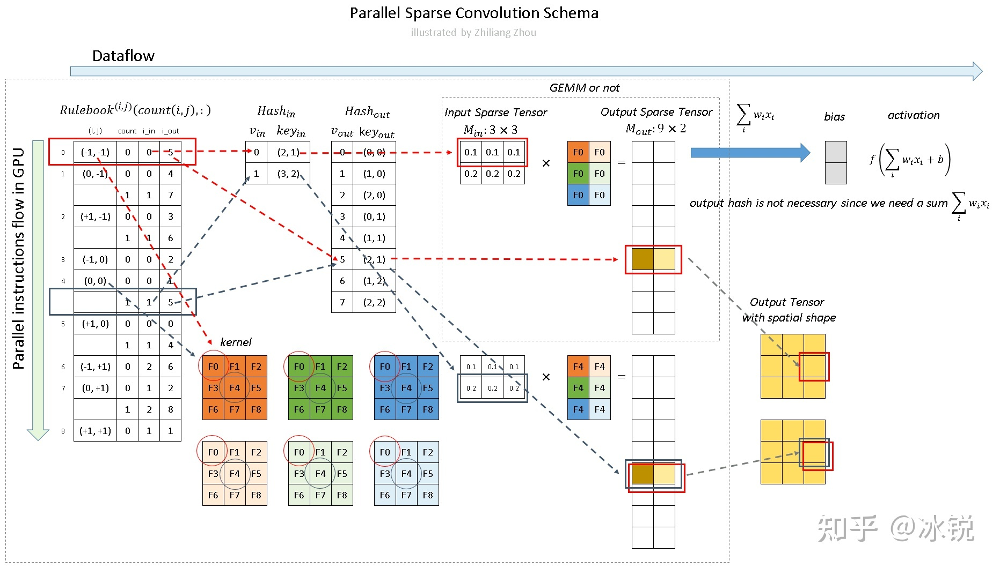

- - -

https://zhuanlan.zhihu.com/p/382365889

- 稀疏卷积的通俗理解：不知道是spconv1.x？ or 2.x  
  本文的理论部分是在“3D Semantic Segmentation with Submanifold Sparse Convolutional Networks”的基础上完成的。 实现部分，是基于“SECOND: Sparsely
  Embedded Convolutional Detection”的论文。

* 为什么提出稀疏卷积？它有什么好处？：
    - 卷积神经网络已经被证明对于二维图像信号处理是非常有效的然而，对于三维点云信号，额外的维数 z 显著增加了计算量。 另一方面，与普通图像不同的是，大多数三维点云的体素是空的，这使得三维体素中的点云数据通常是稀疏信号。
      我们是否只能有效地计算稀疏数据的卷积，而不是扫描所有的图像像素或空间体素？ 否则这些空白区域带来的计算量太多余了。 这就是 sparse convolution 提出的motivation。

* 定义： 本文以二维稀疏图像处理为例 由于稀疏信号采用数据列表和索引列表表示，二维和三维稀疏信号没有本质区别。
    * 2D input signal，rank=3，shape=【c=3，h=5，w=5】如图所示，我们有一个5 × 5的3通道图像。除了 P1和 P2两点外，所有像素都是(0,0,0) （虽然0这个假设也很不严谨） P1和
      P2，这种非零元素也称为active input sites。在稀疏格式中，数据列表是[[0.1,0.1,0.1] ，[0.2,0.2,0.2] ，索引列表是[1,2] ，[2,3] ，并且是 YX 顺序。
      (这个xy顺序就看图理解了，竖着的是y横着的是x，是像素的那种感觉)（看数据格式就知道是三通道的）
      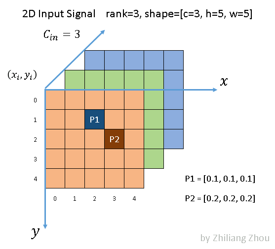
    * kernel的定义：假设使用以下参数进行卷积操作  
      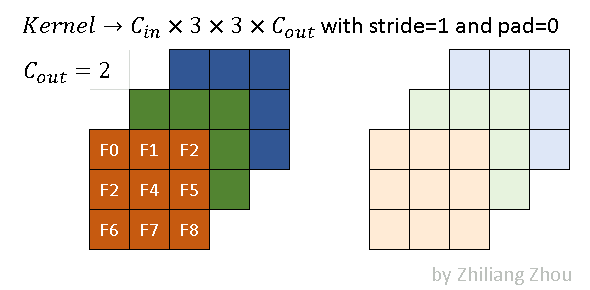  
      稀疏卷积的卷积核与传统的卷积核相同。（注意现在是2D这边的稀疏卷积）  
      深色和浅色代表两种滤镜(叫卷积核会更好)
      在本例中，我们使用以下卷积参数。  
      `
      conv2D(kernel_size=3, out_channels=2, stride=1, padding=0) in channel 呢
      `
    * 输出的定义：稀疏卷积的输出与传统的卷积有很大的不同。对于稀疏卷积的发展，有两篇很重要的论文，所以对应的，稀疏卷积也有两种输出。
        * 一种是 regular output definition，就像普通的卷积一样，只要kernel 覆盖一个 active input site，就可以计算出output site。
        * 另一个称为submanifold output definition。只有当kernel的中心覆盖一个 active input site时，卷积输出才会被计算。  
          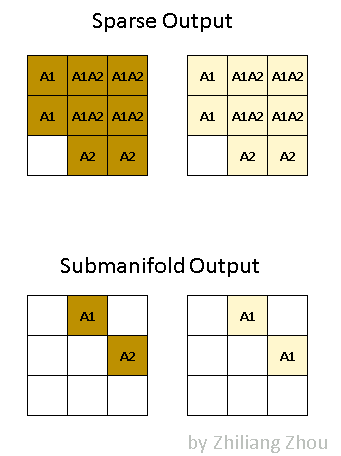  
          上图说明了这两种输出之间的区别  
          A1代表 active site，即 P1产生的卷积结果。 类似地，A2代表从 P2计算出的 active site。A1A2代表 active site，它是 P1和 P2输出的总和。  
          深色和浅色代表不同的输出通道。

* 稀疏卷积的计算过程
    * 1、构建 Input Hash Table 和 Output Hash Table
        * 现在要把 input 和 Output 都表示成 hash table 的形式。 为什么要这么表示呢？因为&^*%。
          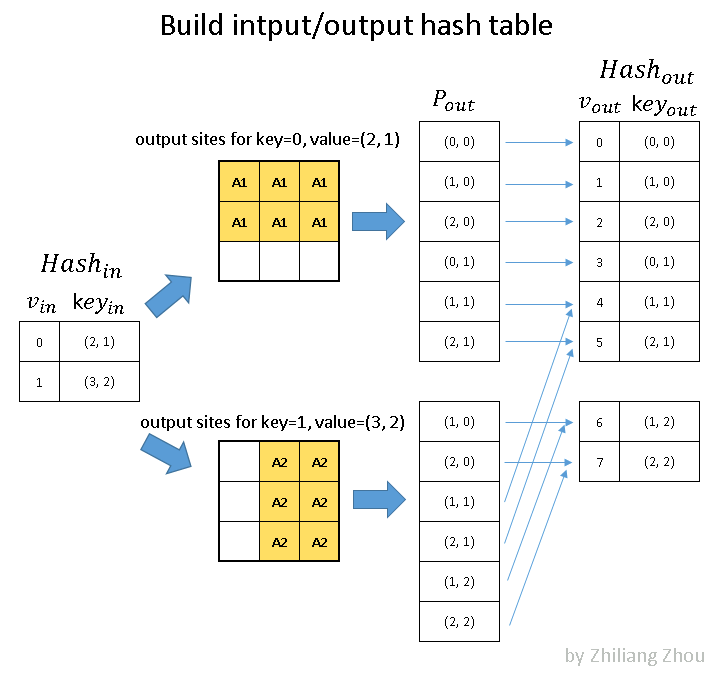  
          input hash table和output hash table 对应上图的 Hash_in，和 Hash_out。  
          对于 Hash_in：  
          v_in 是下标（第几个），key_ in 表示value在input matrix中的位置。  
          （2，1）和（3，2）就是代表了之前的那个image的图  
          现在的input一共两个元素 P1和P2，P1在input matrxi的(2, 1)位置, P2在 input matrix 的(3,2)的位置，并且是 YX 顺序。  
          YX的顺序，Y竖着的，X水平的，明明坐标就是（x，y）啊，为啥他说YX。 （他的意思可能是原理来我们看（2，1）代表了第二行第一列，但是在这里，是横着数3个竖着数2个）
          是的没错，这里只记录一下p1的位置 ，先不管 p1代表的数字。所以其实可以把这个input hash table命名为 input position hash table。  
          input hash tabel的构建完成了，接下来构建 output hash table。

        * 先来看一下卷积过程中 P1是怎么向下传导的： 用一个kernel去进行卷积操作：  
          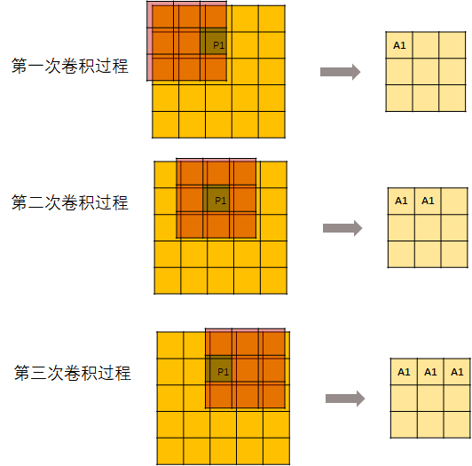  
          但是，并不是每次卷积kernel都可以刚好碰到P1。所以，从第7次开始，输出的这个矩阵就不再变化了。  
          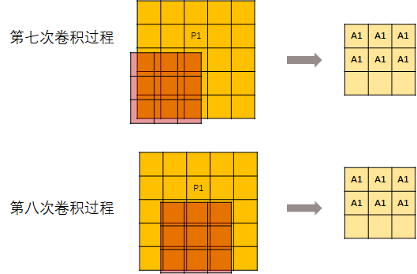  
          然后记录每个元素的位置。  
          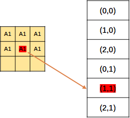  
          记录顺序看他的顺序好像是一列一列的排下去的  
          上面说的只是操作P1，当然P2也是同样的操作。  
          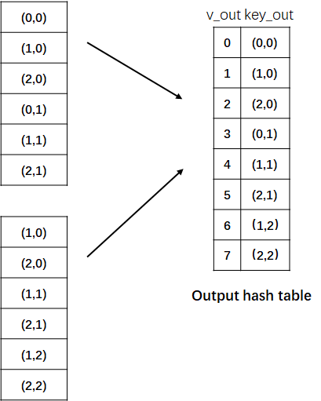  
          然后把P1, P2的结果结合起来（主要是消除掉重复元素），得到了一张位置表。是的没错，此处记录的还是位置。  
          然后编号，就得到了 output hash table。
    * 2、构建 Rulebook
        * 第二步是建立规则手册——rulebook。 这是稀疏卷积的关键部分！！！ （敲黑板了） 规则手册的目的类似于 im2col 它将卷积从数学形式转化为有效的可编程形式。 但是与 im2col
          不同的是，rulebook集合了卷积中所有涉及到的原子运算，然后将它们关联到相应的核元素上。  
          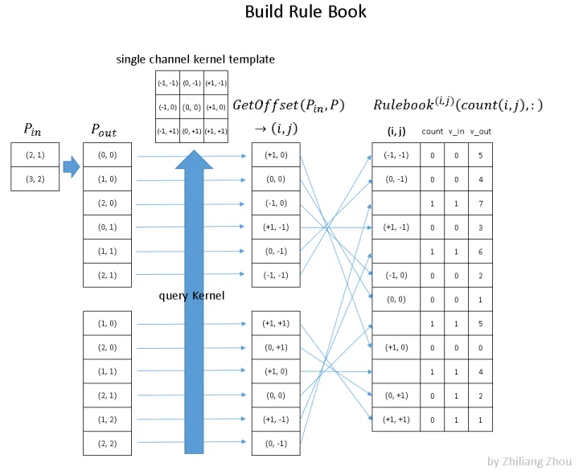

      Getoffset是卷积核中权重（P1、P2）的位置都不告诉大家？？？   
      那个pout怎么映射到getoffset的啊？  
      pin减pout，得到的值作为坐标点，去kernel template中去找对应的值。  
      
      上图就是如何构建 rulebook 的例子。  
      rulebook的每一行都是一个 atomic operation（这个的定义看下面的列子就知道了）， rulebook的第一列是一个索引（offset），第二列是一个计数器count， v_in和 v_ out
      分别是atomic operation的 input hash table 的 index和 output hash tabel的index。 （没错，到现在为止，依然是index，而没有用到真实的数据。）  
      atomic operation是什么呢？举个例子  
      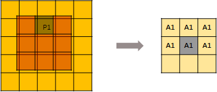
      红色框框表示的是下图的atomic operation  
      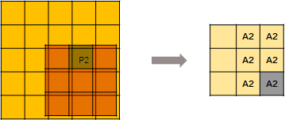
      黄色框框表示的是下图的atomic operation  
    
  因为这个时候(0, -1) 是第二次被遍历到，所以count+1.  

          
          
      

